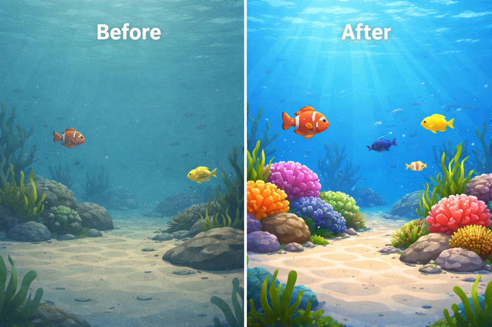

# WF-Diff Extensions: Improving Underwater Image Restoration Metrics

## Project Metadata
### Authors 
- **Team:** Abdulaziz Alfaraj, Hassan Al Nasser, Mohammed Al Naser​
- **Supervisor Name:** Dr. Muzammil Behzad
- **Affiliations:** KFUPM

---

## Introduction
Underwater images often suffer from **color cast**, **low contrast**, **blur**, and **loss of fine details** due to light absorption and scattering in water. These degradations reduce both visual quality and downstream performance for underwater applications such as inspection, robotics, and tracking.

WF-Diff is a strong Underwater Image Enhancement/Restoration (UIE/UIR) framework that combines:
1. **Frequency-domain processing** (Wavelet + Fourier interaction) for preliminary enhancement.
2. **Diffusion-based refinement** in frequency space to recover high-frequency details and improve realism.

In this project, we build on top of WF-Diff’s public implementation and aim to contribute **research-driven improvements** that enhance image restoration performance (quantitative metrics + qualitative visual quality) under consistent evaluation settings.

**Introductory image:**


---

## Problem Statement
We treat underwater image restoration as an **image-to-image enhancement** task:

- **Input:** degraded underwater image
- **Output:** enhanced/restored image with reduced color distortion and improved texture/detail

Because the field can be sensitive to evaluation settings (e.g., full-resolution testing vs resizing), we will report results under clearly stated protocols and focus on improvements measurable by standard restoration metrics.

**Evaluation metrics (commonly used for UIEB/LSUI and related UIE benchmarks):**
- **PSNR / SSIM** (paired quality)
- **LPIPS / FID** (perceptual similarity / realism)
- Optional non-reference metrics (for unpaired test sets): **UIQM / UCIQE** (if applicable)

**Key Questions**
- **Q1:** Which types of modifications contribute most to improving restoration quality (quantitative + qualitative)?
- **Q2:** Do improvements generalize across datasets (e.g., UIEB → LSUI) and across different underwater conditions?
- **Q3:** What is the tradeoff between visual quality and computational cost (diffusion refinement can be expensive)?

---

## Application Area and Project Domain
Underwater image restoration is important for:
- Underwater robotics and navigation
- Marine inspection and infrastructure monitoring (pipelines, hulls, coral surveys)
- Underwater object detection/tracking pipelines (where enhancement improves visibility)
- Scientific imaging and exploration (improving human interpretability and analysis)

---

## What is the paper trying to do, and what are you planning to do?
### What the reference paper does (WF-Diff)
WF-Diff proposes a two-stage framework:
1. **WFI2-net (Wavelet-based Fourier Information Interaction Network)**  
   Performs preliminary enhancement in the **wavelet space**, integrating frequency cues through wavelet decomposition and Fourier information interaction.

2. **FRDAM (Frequency Residual Diffusion Adjustment Module)**  
   Refines both **low-frequency** and **high-frequency** information using diffusion-based adjustment in frequency space. FRDAM is designed as a plug-and-play refinement module.

### What we are planning to do
We will build on the WF-Diff framework and contribute **research-level improvements** aimed at increasing restoration quality metrics and visual fidelity. Our repo will include:
- Implemented model-level and/or training-level extensions to WF-Diff
- Reproducible experiments and ablations (baseline vs our variants)
- Quantitative results on UIEB and LSUI and qualitative comparisons
- Clear discussion of tradeoffs (quality vs runtime)

---

## Project Documents
- **Presentation PDF:** [Project Presentation](./CVProjectPresentation1.pdf)
- **Presentation PPTX:** [Project Presentation](./CVProjectPresentation1.pptx)
- **Term Paper PDF:** [Term Paper](https://openaccess.thecvf.com/content/CVPR2024/papers/Zhao_Wavelet-based_Fourier_Information_Interaction_with_Frequency_Diffusion_Adjustment_for_Underwater_CVPR_2024_paper.pdf)
- **Term Paper Latex Files:** [Term Paper Latex files](https://arxiv.org/src/2311.16845)

---

## References

### Reference Paper
- **WF-Diff (CVPR 2024):** Wavelet-based Fourier Information Interaction with Frequency Diffusion Adjustment for Underwater Image Restoration  
  - CVF OpenAccess (paper): https://openaccess.thecvf.com/content/CVPR2024/html/Zhao_Wavelet-based_Fourier_Information_Interaction_with_Frequency_Diffusion_Adjustment_for_Underwater_CVPR_2024_paper.html  
  - PDF: https://openaccess.thecvf.com/content/CVPR2024/papers/Zhao_Wavelet-based_Fourier_Information_Interaction_with_Frequency_Diffusion_Adjustment_for_Underwater_CVPR_2024_paper.pdf  

### Reference GitHub (Upstream Implementation)
- **WF-Diff official repo:** https://github.com/ChenzhaoNju/WF-Diff

### Reference Dataset
- **UIEB (split provided by upstream):** https://pan.baidu.com/s/1BWtIPz-xUDaatsncOFCJHg?pwd=123x  
- **LSUI (split provided by upstream):** https://pan.baidu.com/s/1-Nk8iqmOVIl3ulZTHkdpbQ?pwd=123x  
- **Extraction code:** 123x

---

## Project Technicalities

### Project UI
- Primary usage is via **command-line training/testing scripts** (BasicSR-style).
- Optional: notebooks or demo scripts for single-image inference and visualization.

### Terminologies
- **UIE/UIR (Underwater Image Enhancement/Restoration):** Improving underwater images by correcting color and restoring contrast/details.
- **Frequency Domain:** Representing images in terms of frequency components (low-frequency = structure/color, high-frequency = edges/details).
- **Wavelet Transform (DWT/IWT):** Decomposes an image into low/high-frequency subbands; useful for targeted enhancement.
- **Fourier Transform (FFT):** Represents an image using frequency magnitude/phase; useful for global frequency behavior.
- **WFI2-net:** WF-Diff’s preliminary enhancement network in wavelet space.
- **FRDAM:** WF-Diff’s diffusion-based refinement module for frequency residual adjustment.
- **Diffusion Model:** A generative refinement process that iteratively denoises a signal to improve details/quality.
- **PSNR / SSIM:** Standard paired image restoration metrics.
- **LPIPS / FID:** Perceptual quality and distribution similarity metrics.

### Problem Statements
- **Problem 1:** Underwater degradations are diverse and hard to model with pixel-only methods.
- **Problem 2:** Restoration quality can depend heavily on frequency details and cross-frequency interactions.
- **Problem 3:** Diffusion-based refinement can improve quality but may introduce higher runtime cost.

### Loopholes or Research Areas
- **Runtime vs quality:** reducing diffusion sampling cost while maintaining quality.
- **Generalization:** robustness across datasets and underwater conditions.
- **Frequency modeling:** stronger cross-frequency interaction and better detail preservation.
- **Perceptual quality:** improving perceptual metrics and reducing artifacts without harming PSNR/SSIM.

### Problem vs. Ideation: Proposed 3 Ideas to Solve the Problems
1. **Frequency-aware architecture refinement:** improve how low/high-frequency information interacts (better fusion/conditioning).
2. **Diffusion efficiency improvements:** explore ways to reduce refinement steps or improve sampling strategy while keeping quality.
3. **Loss and training improvements:** explore improved objectives (frequency losses, perceptual losses, consistency losses) to improve metrics and visual quality.

### Proposed Solution: Code-Based Implementation
This repository provides an implementation of WF-Diff-based improvements using PyTorch (BasicSR/BasicIR-style structure). The solution will include:
- Extensions to frequency-domain processing and/or diffusion refinement modules.
- Training and evaluation scripts/configs for baseline WF-Diff and our variants.
- Scripts for computing metrics and generating qualitative comparisons.

### Key Components (Typical Repo Structure)
- **`basicsr/archs/`**: model architectures (WFI2-net, FRDAM, wavelet/frequency ops, and our extensions)
- **`basicsr/models/`**: training wrappers, losses, diffusion utilities
- **`options/train/`**: YAML configs for training
- **`options/test/`**: YAML configs for testing
- **`basicsr/train.py`**: training entrypoint
- **`basicsr/test.py`**: testing entrypoint

---

## Model Workflow
WF-Diff-style restoration follows this high-level pipeline:

1. **Input:** underwater image  
2. **Wavelet decomposition (DWT):** split image into low/high-frequency subbands  
3. **Frequency preliminary enhancement (WFI2-net):** enhance frequency representations and cross-frequency interaction  
4. **Initial enhanced image:** reconstruct coarse enhancement  
5. **Frequency diffusion adjustment (FRDAM):** refine low/high-frequency residuals using diffusion-based adjustment  
6. **Output:** final restored underwater image

---

## How to Run the Code

### 1) Clone the Repository
```bash
git clone https://github.com/BRAIN-Lab-AI/WaveLift-Fast-Frequency-Guided-Underwater-Restoration.git
cd WaveLift-Fast-Frequency-Guided-Underwater-Restoration
```
### 2) Set Up the Environment
Create and activate an environment, then install dependencies.
```bash
conda create -n wfdiff_ext python=3.10 -y
conda activate wfdiff_ext
pip install -r requirements.txt
```

### 3) Download Datasets

Download the official splits provided by the upstream WF-Diff repository:

UIEB: https://pan.baidu.com/s/1BWtIPz-xUDaatsncOFCJHg?pwd=123x

LSUI: https://pan.baidu.com/s/1-Nk8iqmOVIl3ulZTHkdpbQ?pwd=123x

Extraction code: 123x

Place the dataset folders locally and update the dataset paths inside the YAML configs in options/.

Tip: After editing paths, verify the dataloader can find images by running a short test/inference first.

### 4) Train
   ```bash
   CUDA_VISIBLE_DEVICES=0 python basicsr/train.py -opt options/train/train_Wfdiff.yml
   ```
### 5) Test
   ```bash
   CUDA_VISIBLE_DEVICES=0 python basicsr/test.py -opt options/test/test_wfdiff.yml
   ``` 
### 6) Outputs

Training logs and checkpoints are saved under the directory specified in your YAML config (usually under experiments/).

Test outputs (restored images + metrics) are saved under the directory specified in the test YAML (often under results/).

---

## How to Train the Model

This repository supports two training paths:
1. **Baseline WF-Diff** (upstream BasicSR-style trainer) — for reproducing the reference paper.
2. **WaveFlow-UIE** (our extension) — flow-matching variant with physics prior and frequency-weighted loss.

### 1) Prepare the Dataset
Organize paired underwater images as:
```
data/
└── UIEB/
    ├── train/
    │   ├── input/    # degraded images
    │   └── target/   # reference (clean) images
    └── test/
        ├── input/
        └── target/
```
Update the dataset paths in the YAML config you plan to use (`data.train_input`, `data.train_target`, `data.val_input`, `data.val_target`).

### 2) Pick a Config

**Baseline WF-Diff:** [options/train/train_Wfdiff.yml](options/train/train_Wfdiff.yml)

**WaveFlow-UIE (our model):** choose one from [configs/](configs/):
| Config | Purpose |
|---|---|
| `waveflow_uie_uieb.yaml` | Main config — physics prior on, freq LL:HF = 1:2 |
| `waveflow_uie_no_physics.yaml` | Ablation — physics prior disabled |
| `waveflow_uie_no_freq_weight.yaml` | Ablation — uniform frequency loss |
| `waveflow_uie_equal_loss.yaml` | Ablation — equal weighting across loss terms |

Key fields inside a config:
- `data.patch_size`, `data.batch_size`, `data.num_workers`
- `training.total_iters`, `training.grad_accum_steps`, `training.fp16`, `training.grad_clip`, `training.warmup_iters`
- `training.optimizer` (AdamW lr/weight_decay/betas) and `training.scheduler` (CosineAnnealingLR)
- `training.ema` (warmup 0.99 → target 0.999)
- `training.losses` (CFM, frequency, LPIPS, Lab, physics weights)
- `validation.val_freq_early/late`, `validation.metrics`
- `logging.print_freq`, `logging.save_checkpoint_freq`

### 3) Launch Training

**Baseline WF-Diff:**
```bash
CUDA_VISIBLE_DEVICES=0 python basicsr/train.py -opt options/train/train_Wfdiff.yml
```

**WaveFlow-UIE:**
```bash
python -m waveflow_uie.train --config configs/waveflow_uie_uieb.yaml --seed 42
```
CLI flags (see [waveflow_uie/train.py:431-434](waveflow_uie/train.py#L431-L434)):
- `--config` (required) — path to YAML config
- `--seed` — random seed (default 42)
- `--resume` — checkpoint path to resume from

**Resume from a checkpoint:**
```bash
python -m waveflow_uie.train --config configs/waveflow_uie_uieb.yaml --resume experiments/<run_name>/checkpoints/latest.pt
```

### 4) Monitor Progress
- **Console:** loss values printed every `logging.print_freq` steps.
- **TensorBoard:** run `tensorboard --logdir experiments/<run_name>/tb` to see loss curves, LR, and validation PSNR/SSIM/LPIPS.
- **Validation:** runs every `val_freq_early` steps initially, then `val_freq_late` after `val_freq_threshold` — metrics and sample images are logged.
- **Checkpoints:** saved every `save_checkpoint_freq` steps under `experiments/<run_name>/checkpoints/`; best-PSNR checkpoint is tracked separately.

### 5) Training Notes
- Mixed precision (FP16) with gradient scaling is on by default — disable via `training.fp16: false` if you hit numerical issues.
- Effective batch size = `batch_size * grad_accum_steps`.
- The trainer has built-in NaN recovery (reloads latest checkpoint and reduces LR).
- For ablations, keep `experiment.seed` fixed across runs so comparisons are fair.
